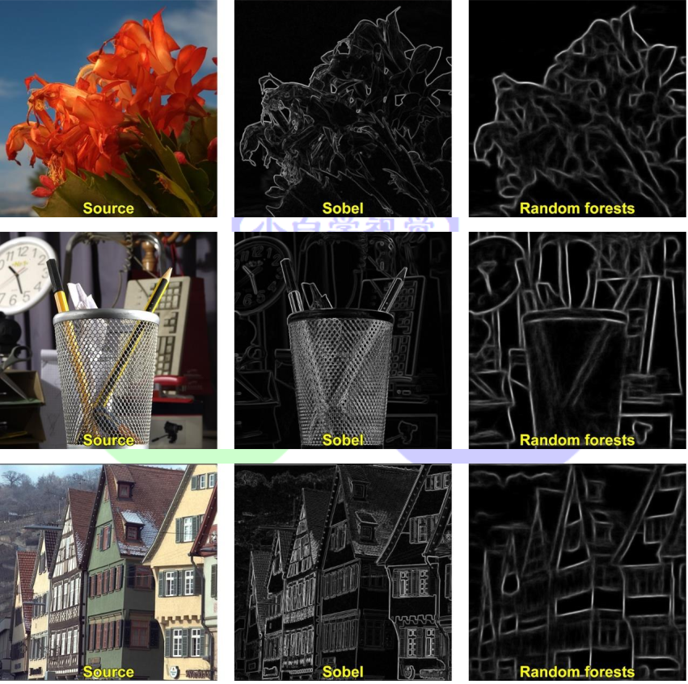
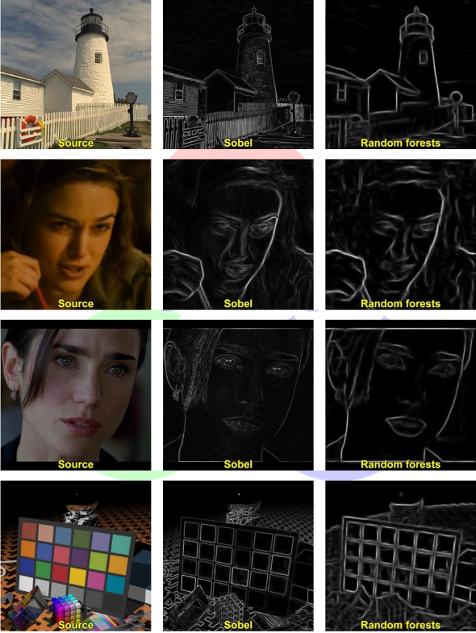
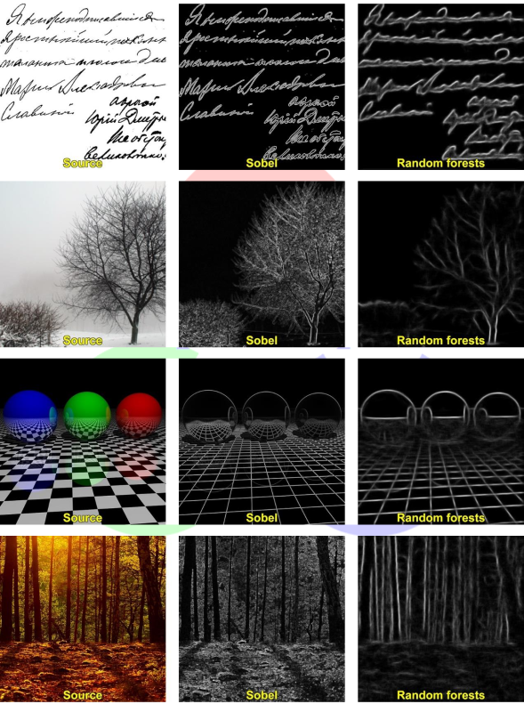
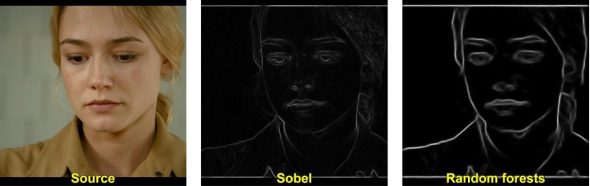

# 20.2 用于快速边缘检测的结构化森林(Structured forests)

在本节教程中,我们将学会使用结构化森林来进行图像边缘检测。该算法的具体原理读者可以查阅下面两篇文章进行详细学习:

- Structured forests for fast edge detection
- Sketch tokens: A learned mid-level representation for contour and object detection

## 20.2.1 例图

本历程中所有使用的图片和处理结果都在下方给出。读者也可以在小白学视觉公众号后台回复“**快速边缘检测**”获取所有图片。









> 注意：
>
> Canny边 缘 检 测 等 二 值 化 技 术 适 用 于 两 种 算 法 (Sobel 和StructuredEdgeDetection::detectEdges)生成的边缘。

## 20.2.2 C++代码

```
/**************************************************************************************
 The structered edge demo requires you to provide a model.
 This model can be found at the opencv_extra repository on Github on the following link:
 https://github.com/opencv/opencv_extra/blob/master/testdata/cv/ximgproc/model.yml.gz
 ***************************************************************************************/
 
 #include <opencv2/ximgproc.hpp>
 #include "opencv2/highgui.hpp"
 #include "opencv2/core/utility.hpp"
 #include <iostream>
 
 using namespace cv;
 using namespace cv::ximgproc;
 
 const char* keys =
 {
     "{i || input image name}"
     "{m || model name}"
     "{o || output image name}"
 };
 
 int main( int argc, const char** argv )
 {
     bool printHelp = ( argc == 1 );
     printHelp = printHelp || ( argc == 2 && String(argv[1]) == "--help" );
     printHelp = printHelp || ( argc == 2 && String(argv[1]) == "-h" );
 
     if ( printHelp )
     {
         std::cout << "\nThis sample demonstrates structured forests for fast edge detection\n"
                "Call:\n"
                "    structured_edge_detection -i=in_image_name -m=model_name [-o=out_image_name]\n\n";
         return 0;
     }
 
     CommandLineParser parser(argc, argv, keys);
     if ( !parser.check() )
     {
         parser.printErrors();
         return -1;
     }
 
     String modelFilename = parser.get<String>("m");
     String inFilename = parser.get<String>("i");
     String outFilename = parser.get<String>("o");
 
     Mat image = imread(inFilename, 1);
     if ( image.empty() )
         CV_Error(Error::StsError, String("Cannot read image file: ") + inFilename);
 
     if ( modelFilename.size() == 0)
         CV_Error(Error::StsError, String("Empty model name"));
 
     image.convertTo(image, DataType<float>::type, 1/255.0);
 
     Mat edges(image.size(), image.type());
 
     Ptr<StructuredEdgeDetection> pDollar =
         createStructuredEdgeDetection(modelFilename);
     pDollar->detectEdges(image, edges);
 
     // computes orientation from edge map
     Mat orientation_map;
     pDollar->computeOrientation(edges, orientation_map);
 
     // suppress edges
     Mat edge_nms;
     pDollar->edgesNms(edges, orientation_map, edge_nms, 2, 0, 1, true);
 
     if ( outFilename.size() == 0 )
     {
         namedWindow("edges", 1);
         imshow("edges", edges);
         namedWindow("edges nms", 1);
         imshow("edges nms", edge_nms);
         waitKey(0);
     }
     else
         imwrite(outFilename, 255*edges);
 
     return 0;
 }
```

## 20.2.3 代码解释

1、加载源彩色图片

代码清单 20-7:加载图片

```
cv::Mat image = cv::imread(inFilename, 1);
if ( image.empty() )
{
    printf("Cannot read image file: %s\n", inFilename.c_str());
    return -1;
}
```

2、将源图转换到[0,1]范围内

代码清单 20-8:改变图像数据类型

```
image.convertTo(image, cv::DataType<float>::type, 1/255.0);
```

3、执行主算法

代码清单 20-9:执行算法

```
cv::Mat edges(image.size(), image.type());
cv::Ptr<StructuredEdgeDetection> pDollar =
    cv::createStructuredEdgeDetection(modelFilename);
pDollar->detectEdges(image, edges);
```

4、展示结果

代码清单 20-10:展示结果

```
if ( outFilename == "" )
{
    cv::namedWindow("edges", 1);
    cv::imshow("edges", edges);
    cv::waitKey(0);
}
else
    cv::imwrite(outFilename, 255*edges);
```

