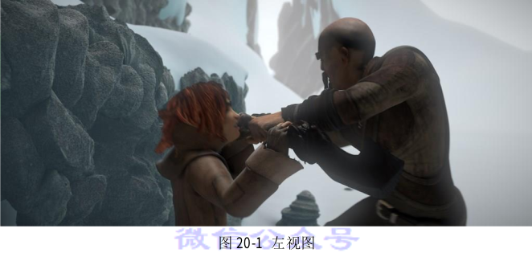
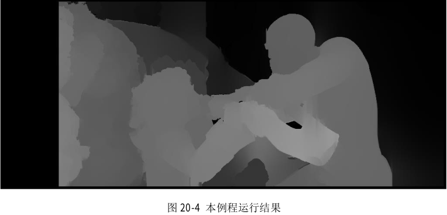

# 20.1 视差图滤波

## 20.1.1 简介

立体匹配算法，尤其是只使用 CPU 需要实时处理的高度优化算法，在面对具有挑战性的序列上往往会出现相当多的错误。这些误差通常集中在均匀的无纹理区域、半遮挡区域和靠近深度不连续区域。一个解决立体匹配误差的方法就是使用各种技术检测潜在的不准确的视差值并使其无效，从而使视差图半稀疏化。一些这种思想的算法已经在 StereoBM 和StereoSGBM 中实现。另一种方法是使用某种过滤手段将视差图的边缘与源图像的边缘对齐，并将视差值从高置信区域传播到低置信区域(如半遮挡区域)。最近在边缘感知过滤方面的进展使得在 CPU 实时处理的约束下能够执行这种后过滤。

在本节教程中，我们将学习如何对视差图进行滤波来改进 StereoBM 和 StereoSGBM 算法的结果。本教程使用的两张图像分别在图 20-1 和图 20-2 中给出。




## 20.1.2 C++代码

我们将使用示例应用程序中的代码片段作为讲解使用,完整的代码可以从 OpenCV 官网[下载](https://github.com/opencv/opencv_contrib/blob/master/modules/ximgproc/samples/disparity_filtering.cpp)。

> 提示
>
> 本教程的完整程序可以在小白学视觉微信公众号后台回复“视差图滤波”获取。

  

## 20.1.3 代码解释

所提供的示例具有多个选项，这些选项在生成的视差图的速度和质量之间产生了不同的权衡。 如果用户提供了真实的视差图，则将同时测量速度和质量。 在本教程中，我们将详细介绍默认管道，该管道旨在在CPU实时处理的约束下提供最佳质量。

**代码清单 20-1:加载左右视图**

```
    Mat left  = imread(left_im ,IMREAD_COLOR);
    if ( left.empty() )
    {
        cout<<"Cannot read image file: "<<left_im;
        return -1;
    }
    Mat right = imread(right_im,IMREAD_COLOR);
    if ( right.empty() )
    {
        cout<<"Cannot read image file: "<<right_im;
        return -1;
    }
```

我们首先加载源立体图对。 在本教程中，我们将以MPI-Sintel数据集中具有很多无纹理区域的示例为例，该示例具有挑战性。

## 20.1.4 准备匹配的视图

**代码清单 20-2**

```
			max_disp/=2;
            if(max_disp%16!=0)
                max_disp += 16-(max_disp%16);
            resize(left ,left_for_matcher ,Size(),0.5,0.5, INTER_LINEAR_EXACT);
            resize(right,right_for_matcher,Size(),0.5,0.5, INTER_LINEAR_EXACT);
```

我们在允许质量轻微下降的前提下对视图进行缩小以加速匹配。如果要获取最好的质量
图,则应该避免进行图像缩小。

## 20.1.5 进行匹配和生成 filter 实例

```
			Ptr<StereoBM> left_matcher = StereoBM::create(max_disp,wsize);
            wls_filter = createDisparityWLSFilter(left_matcher);
            Ptr<StereoMatcher> right_matcher = createRightMatcher(left_matcher);
            cvtColor(left_for_matcher,  left_for_matcher,  COLOR_BGR2GRAY);
            cvtColor(right_for_matcher, right_for_matcher, COLOR_BGR2GRAY);
            matching_time = (double)getTickCount();
            left_matcher-> compute(left_for_matcher, right_for_matcher,left_disp);
            right_matcher->compute(right_for_matcher,left_for_matcher, right_disp);
            matching_time = ((double)getTickCount()-matching_time)/getTickFrequency();
```

为了更快地处理,我们使用 StereoBM 算法。如果对速度要求不高，那么 StereoSGBM算法则能够提供更好的质量。filter 实例是通过我们打算使用的 StereoMatcher 实例创建的。createRightMatcher()函数会返回另一个 matcher 实例。然后使用这两个 matcher 实例来计算左边和右边视图的视差图。

## 20.1.6 进行滤波

```
		wls_filter->setLambda(lambda);
        wls_filter->setSigmaColor(sigma);
        filtering_time = (double)getTickCount();
        wls_filter->filter(left_disp,left,filtered_disp,right_disp);
        filtering_time = ((double)getTickCount() - filtering_time)/getTickFrequency();
```

由各个 matcher 实例得到的视差图以及源左视图传给 filter。这里需要注意,滤波过程需要使用原始的非缩小视图。视差图会以边缘感知的方式自动放大,以匹配原始的视图分辨率。结果存储在 filtered_disp 中。

## 20.1.7 可视化视差图

```
		Mat raw_disp_vis;
        getDisparityVis(left_disp,raw_disp_vis,vis_mult);
        namedWindow("raw disparity", WINDOW_AUTOSIZE);
        imshow("raw disparity", raw_disp_vis);
        Mat filtered_disp_vis;
        getDisparityVis(filtered_disp,filtered_disp_vis,vis_mult);
        namedWindow("filtered disparity", WINDOW_AUTOSIZE);
        imshow("filtered disparity", filtered_disp_vis);
        if(!solved_disp.empty())
        {
            Mat solved_disp_vis;
            getDisparityVis(solved_disp,solved_disp_vis,vis_mult);
            namedWindow("solved disparity", WINDOW_AUTOSIZE);
            imshow("solved disparity", solved_disp_vis);
            Mat solved_filtered_disp_vis;
            getDisparityVis(solved_filtered_disp,solved_filtered_disp_vis,vis_mult);
            namedWindow("solved wls disparity", WINDOW_AUTOSIZE);
            imshow("solved wls disparity", solved_filtered_disp_vis);
        }
        while(1)
        {
            char key = (char)waitKey();
            if( key == 27 || key == 'q' || key == 'Q') // 'ESC'
                break;
        }
```

为了方便,我们使用函数 getdisityvis()来可视化视差图。该函数的第二个参数定义对比度(在可视化中,所有的视差值都由这个值缩放)。

## 20.1.8 结果


