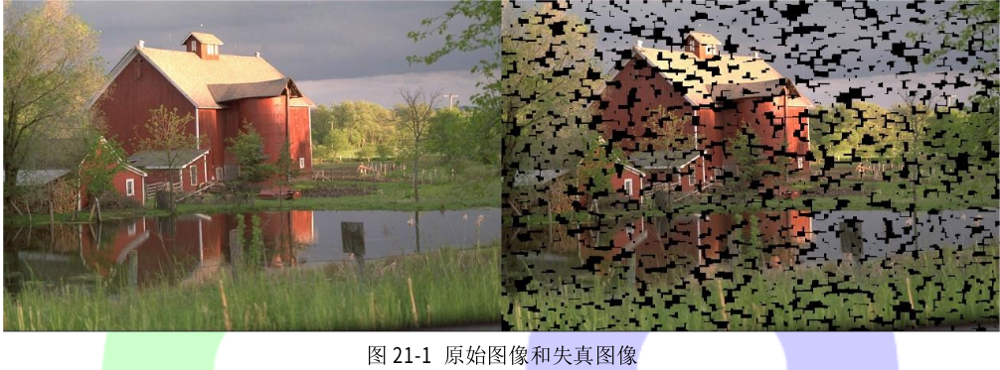
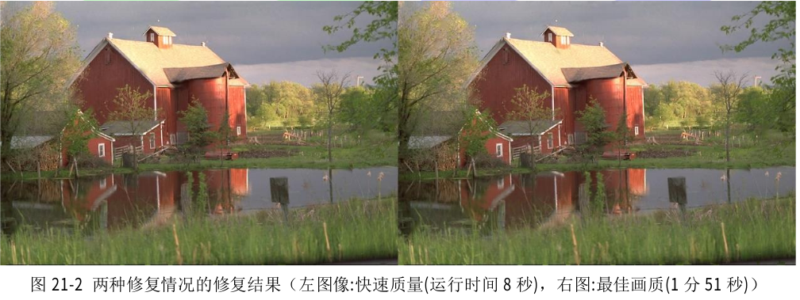

# 21.1 图像修复

在本节篇教程中,我们将学习如何使用快速频率选择重构(FSR)来进行图像修复。

## 21.1.1 图像修复基础

图像修补是重建图像中受损或缺失部分的过程,通过用类似于相邻像素的像素值替换失真的像素实现的图像修复。目前图像修复有多种算法,本教程使用的是快速频率选择重构(FSR)法。FSR 利用图像小区域在傅里叶域中可以稀疏表示的特性来重构图像信号。对这个算法感兴趣的读者可以详细阅读下面两篇论文:

- Signal and loss geometry aware frequency selective extrapolation for error concealment
- Resampling images to a regular grid from a non-regular subset of pixel positions using
  frequency selective reconstruction

FSR 可以应用于以下应用领域:

- 图像修复:采样掩模表示需要重建的失真输入图像的缺失像素。
-  不规则采样:有关如何选择好的采样掩模。

## 21.1.2 示例教程

代码清单 21-1 中给出了如何使用 FSR 进行图像修复。掩模的非零像素表示有效的图像区域，零像素表示需要重建的区域。我们可以使用 Paint 或 GIMP 等工具手动创建任意掩码。例如从一个简单的白色图像开始,用黑色画一些变形。原始图像、含有失真区域的图像以及修复后的图像分别在图 21-1 和图 21-2 中给出。

**代码清单 21-1:图像修复示例程序**

```c++
#include <opencv2/opencv.hpp>
#include <opencv2/xphoto/inpainting.hpp>
#include <iostream>
using namespace cv;
int main(int argc, char** argv)
{
    // read image and error pattern
    Mat original_, mask_;
    original_ = imread("images/kodim22.png");
    mask_ = imread("images/pattern_random.png", IMREAD_GRAYSCALE);
    // make sure that mask and source image have the same size
    Mat mask;
    resize(mask_, mask, original_.size(), 0.0, 0.0, cv::INTER_NEAREST);
    // distort image
    Mat im_distorted(original_.size(), original_.type(), Scalar::all(0));
    original_.copyTo(im_distorted, mask); // copy valid pixels only (i.e. non-zero pixels in mask)
    // reconstruct the distorted image
    // choose quality profile fast (xphoto::INPAINT_FSR_FAST) or best (xphoto::INPAINT_FSR_BEST)
    Mat reconstructed;
    xphoto::inpaint(im_distorted, mask, reconstructed, xphoto::INPAINT_FSR_FAST);
    imshow("orignal image", original_);
    imshow("distorted image", im_distorted);
    imshow("reconstructed image", reconstructed);
    waitKey();
    return 0;
}
```

<p align="center">



</p>

<p align="center">



</p>

