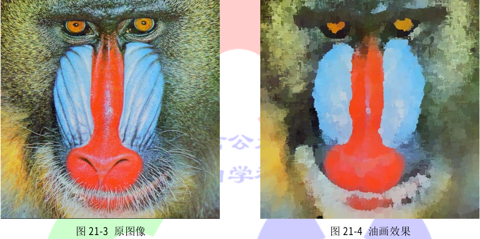

# 21.2 油画效果

图像具有多个颜色空间,默认颜色空间为 COLOR_BGR2GRAY。对于图像中的每个像素,如果计算其相邻的大小为 2×size+1 区域的直方图(颜色空间的第一个平面),并将最常出现的值赋给该像素点,这样的结果看起来就很像油画了。xphoto 模块中的 oilPainting()函数便可以实现将普通图像转换成优化的效果的参数 4 来降低图像的动态性,从而提高油画的效果。该函数的使用方式在代码清单 21-2 中给出,转换成的优化效果在图 21-4 给出。

**代码清单 21-2**

```
Mat img;
Mat dst;
img = imread("opencv/samples/data/baboon.jpg");
xphoto::oilPainting(img, dst, 10, 1, COLOR_BGR2Lab);
imshow("oil painting effect", dst);
```

<p align="center">



</p>

